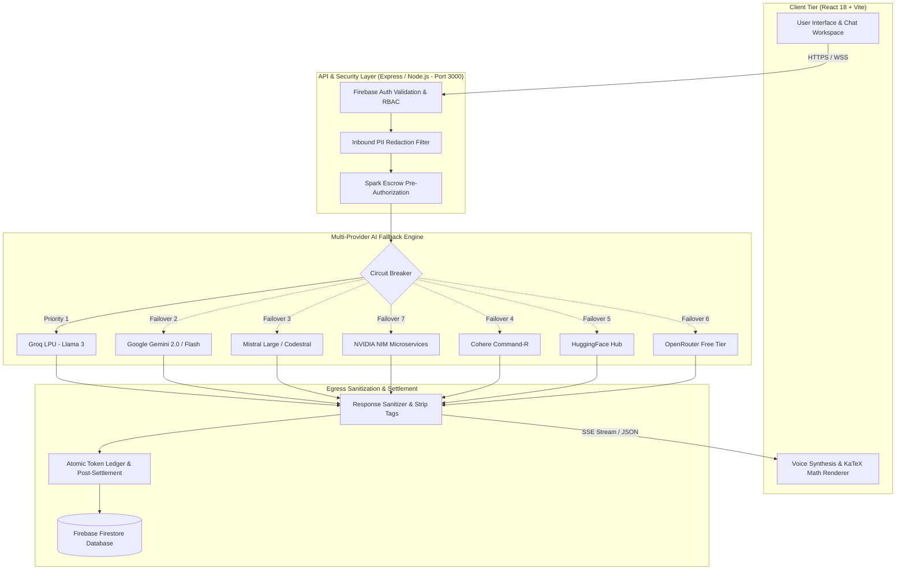

# 🎓 UniAce Mastery Hub (UniAce Ecosystem)

[](https://uniace-ecosystem.onrender.com)
[](https://www.typescriptlang.org/)
[](https://react.dev/)
[](https://vitejs.dev/)
[](https://nodejs.org/)
[](https://firebase.google.com/)
[](https://www.docker.com/)
[](LICENSE)

> **UniAce Mastery Hub** is an enterprise-grade, multi-provider AI learning ecosystem engineered for university students, educators, and academic institutions. It bridges rigorous STEM and humanities curricula with adaptive spaced-repetition analytics, mathematical typesetting, real-time voice synthesis, and fault-tolerant multi-model AI routing.

---

## 📑 Table of Contents

- [Core Feature Modules](#-core-feature-modules)
- [System Architecture & Security](#-system-architecture--security)
- [Multi-Provider AI Routing](#-multi-provider-ai-routing)
- [Technology Stack](#-technology-stack)
- [Project Directory Structure](#-project-directory-structure)
- [Getting Started & Local Development](#-getting-started--local-development)
- [Environment Variables Reference](#-environment-variables-reference)
- [Production Deployment](#-production-deployment)
- [Testing & Quality Assurance](#-testing--quality-assurance)
- [Contributing](#-contributing)
- [License](#-license)

---

## ⚡ Core Feature Modules

### 1. 🧠 Interactive AI Academic Tutor
- **Tri-Level Explanation Engine:** Toggles explanations across **Intuitive** (analogies & high-level models), **Core Mechanics** (operational dynamics), and **Rigorous Proof** (formal mathematical and algorithmic derivations).
- **Native KaTeX / LaTeX Rendering:** First-class typesetting for chemical formulas, matrix calculus, differential equations, and thermodynamic equations (`$ ... $` and `$$ ... $$`).
- **Multimodal Context & OCR:** Upload diagrams, circuit layouts, and past examination papers for instant computer-vision breakdown.

### 2. 📈 Adaptive Mastery Center & Spaced Repetition
- **Ebbinghaus Decay Tracking:** Algorithmic calculation determining optimal revision intervals per topic.
- **Mastery Score Engine (0–100%):** Weighted retention models tracking active recall scores, quiz accuracies, and conceptual confidence.
- **Exam Readiness Index:** Real-time percentage indicator benchmarking student preparation against university syllabi.

### 3. 📝 Smart Problem & Question Bank Hub
- **Dynamic Assessment Generator:** Generates multiple choice (MCQ), fill-in-the-blank, diagnostic scenario-based, and step-by-step technical problem sets.
- **Past Paper Archives & Diagnostic Benchmarks:** Ingests previous examination questions with automated model-answer breakdowns.

### 4. 🗓️ Study Architect & Exam Countdown
- **Dynamic Curriculum Scheduling:** Deconstructs complex syllabi into milestone-driven daily sessions.
- **Calendar Synchronization:** Direct export to iCalendar (`.ics`) and Google Calendar protocols.

### 5. 🎙️ Real-Time Voice Synthesis & Auditory Tutor
- **Low-Latency Speech Processing:** Streaming voice synthesis optimized for auditory comprehension and mobile learning sessions.
- **Phonetic Formula Articulation:** Translates mathematical and chemical notation into readable verbal explanations.

### 6. 🛠️ Administrative & Telemetry Control Center
- **Telemetry & Latency Monitoring:** Real-time dashboard monitoring token expenditures, latency percentiles (p50/p95/p99), and provider uptime.
- **Role-Based Access Control (RBAC):** Granular permissions separating `Student`, `Faculty/Instructor`, and `SuperAdmin`.
- **System Broadcast Engine:** Global banner notifications and scheduled maintenance alerts.

---

## 🛡️ System Architecture & Security



### Key Architectural Tenets:
1. **Circuit-Breaker AI Fallback:** Continuous health probing dynamically shifts traffic across the provider queue within milliseconds of rate limiting (HTTP 429), authentication errors (401/403), or upstream latency spikes.
2. **Economic Spark Escrow Engine:** Prevents abusive compute loops by reserving estimated tokens in escrow prior to payload dispatch, settling the exact delta atomically upon stream closure.
3. **Multi-Stage Sanitization Pipeline:**
   - **Inbound:** Strips PII, sensitive session credentials, and adversarial jailbreak prompts (`redactPII`).
   - **Outbound:** Isolates internal `<think>...</think>` reasoning traces and guarantees mathematical LaTeX boundary closure (`sanitizeAIResponse`).

---

## 🤖 Multi-Provider AI Routing

The platform routes academic queries through a prioritized multi-provider queue:

| Priority | Provider | Primary Use Case |
|---|---|---|
| **1** | **Groq (LPU)** | High-speed, low-latency reasoning and conversational Q&A |
| **2** | **Google Gemini** | Deep scientific analysis, long-context syllabi, and image/diagram vision |
| **3** | **Mistral AI** | Specialized STEM reasoning and code generation |
| **4** | **Cohere** | Complex semantic retrieval and academic structuring |
| **5** | **HuggingFace** | Open-source foundation model fallbacks |
| **6** | **OpenRouter** | Distributed community models |
| **7** | **NVIDIA NIM** | Accelerated high-parameter vision and reasoning models |

---

## 💻 Technology Stack

| Layer | Technologies |
|---|---|
| **Frontend** | React 18, TypeScript, Vite, Tailwind CSS, Lucide Icons, Framer Motion |
| **Data Viz & Math** | KaTeX, Recharts |
| **Backend** | Node.js, Express, WebSocket (`ws`), Server-Sent Events (SSE), `tsx`, `esbuild` |
| **Database & Auth** | Firebase Firestore, Firebase Authentication, Firebase Admin SDK |
| **AI Inference & SDKs** | Google GenAI SDK (`@google/genai`), Groq SDK, Mistral AI, Cohere, NVIDIA NIM |
| **DevOps & Hosting** | Docker, Render, Cloud Run, UptimeRobot |

---

## 📁 Project Directory Structure

```text
UniAce-Ecosystem/
├── public/                     # Static assets, PWA manifest, and icons
├── server/                     # Backend API & AI Engine
│   └── providers.ts            # Multi-provider AI router & circuit breaker logic
├── src/                        # Frontend Presentation Layer
│   ├── components/             # UI Components (MasteryCenter, ChatBot, QuizHub, AdminDashboard)
│   │   ├── admin/              # Specialized admin management views
│   │   ├── chat/               # Conversational workspace & syllabus jumper
│   │   └── renderers/          # Interactive KaTeX, Mermaid & Diagram visualizers
│   ├── services/               # API clients, Firestore hooks, and AI service wrappers
│   ├── types/                  # Application-wide TypeScript interfaces
│   ├── utils/                  # Learning path algorithms, KaTeX helpers, and iCal exports
│   ├── App.tsx                 # Core application controller and view routing
│   ├── main.tsx                # Client initialization entry point
│   └── index.css               # Global Tailwind CSS directives
├── server.ts                   # Unified Express backend & Vite middleware (Port 3000)
├── firestore.rules             # Firebase Firestore security & role-based rules
├── firebase-blueprint.json     # Schema blueprint definitions
├── package.json                # Dependencies and build scripts
├── tsconfig.json               # TypeScript compiler options
├── Dockerfile                  # Container definition for production deployment
└── vite.config.ts              # Vite bundling pipeline
```

---

## 🚀 Getting Started & Local Development

### Prerequisites
- **Node.js**: `v18.x` or higher
- **npm**: `v9.x` or higher
- A **Google Gemini API Key** and a **Firebase Project**

### Step-by-Step Installation

1. **Clone the repository:**
   ```bash
   git clone https://github.com/uniacesupport/UniAce-Ecosystem.git
   cd UniAce-Ecosystem
   ```

2. **Install dependencies:**
   ```bash
   npm install
   ```

3. **Configure Environment Variables:**
   ```bash
   cp .env.example .env
   ```
   Open `.env` and fill in your API keys (refer to the [Environment Variables](#-environment-variables-reference) table below).

4. **Start the Development Server:**
   ```bash
   npm run dev
   ```
   The application will start on unified port **`http://localhost:3000`** with Express backend APIs and hot Vite client serving.

---

## 🔐 Environment Variables Reference

| Variable | Description | Required | Default |
|---|---|:---:|:---:|
| `PORT` | Application port (fixed) | No | `3000` |
| `NODE_ENV` | Runtime environment (`development` / `production`) | No | `development` |
| `GEMINI_API_KEY` | Google Gemini API key for multimodal reasoning | **Yes** | — |
| `GROQ_API_KEY` | Groq LPU inference key for ultra-fast failover | No | — |
| `MISTRAL_API_KEY` | Mistral AI API key for STEM reasoning | No | — |
| `NVIDIA_NIM_API_KEY` | NVIDIA NIM endpoint key for high-parameter LLMs | No | — |
| `COHERE_API_KEY` | Cohere API key for retrieval models | No | — |
| `HUGGINGFACE_API_KEY` | Hugging Face inference key | No | — |
| `OPENROUTER_API_KEY` | OpenRouter API key | No | — |
| `FIREBASE_PROJECT_ID` | Firebase Project ID for Firestore and Auth | **Yes** | — |
| `FIREBASE_CLIENT_EMAIL`| Service account email for Firebase Admin SDK | **Yes** | — |
| `FIREBASE_PRIVATE_KEY`| Service account RSA private key | **Yes** | — |

---

## 🚢 Production Deployment

### Option 1: Standard Node Production Build
```bash
# Build Vite client and bundle production server via esbuild
npm run build

# Start production server
npm start
```

### Option 2: Docker Containerization
A multi-stage `Dockerfile` is included for containerized hosting environments (Render, Cloud Run, AWS ECS):

```bash
# Build Docker image
docker build -t uniace-mastery-hub .

# Run container with environment configuration
docker run -p 3000:3000 --env-file .env uniace-mastery-hub
```

---

## 🧪 Testing & Quality Assurance

```bash
# Run TypeScript type validation and linting
npm run lint

# Compile and verify full production bundle
npm run build
```

---

## 🤝 Contributing

1. **Fork** the Repository.
2. **Create a Feature Branch:**
   ```bash
   git checkout -b feature/adaptive-flashcards
   ```
3. **Commit your changes:**
   ```bash
   git commit -m "feat(spaced-repetition): add Leitner card decay calculation"
   ```
4. **Push to branch:**
   ```bash
   git push origin feature/adaptive-flashcards
   ```
5. **Open a Pull Request** against `main` detailing rationale, testing steps, and relevant screenshots.

---

## 📄 License

This project is licensed under the **MIT License**. See the [LICENSE](LICENSE) file for details.

---

<p align="center">
  Built with precision by the <b>UniAce Platform Engineering Team</b>.<br/>
  <i>Empowering students and faculty through high-performance learning intelligence.</i>
</p>
